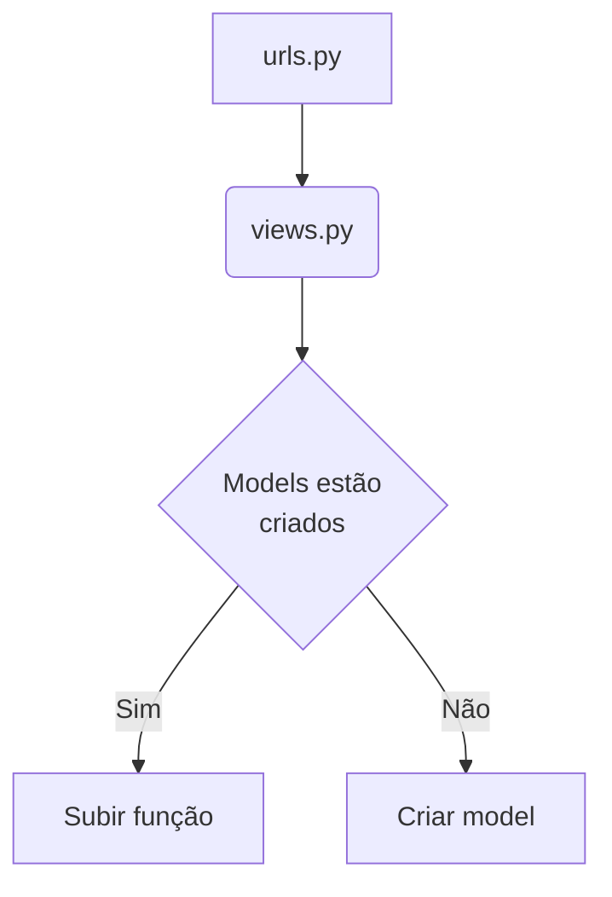

# File Structure

The file structure of the `Sendgrid_webhook` repository follows a specific convention to ensure consistency and organization. This section provides an overview of the main directories and files in the repository.

## Directories

The repository is structured as follows:

*   `src`: This directory contains the source code of the application.

*   `tests`: This directory contains the test files for the application.

*   `docs`: This directory contains the documentation files for the application.

*   `config`: This directory contains configuration files for the application.

## Files

The main files in the repository include:

*   `README.md`: This file provides an overview of the repository and its contents.

*   `requirements.txt`: This file lists the dependencies required to run the application.

*   `manage.py`: This file is the entry point for running Django commands.

*   `settings.py`: This file contains the configuration settings for the Django application.

*   `urls.py`: This file defines the URL patterns for the application.

For a more detailed understanding of the file structure, please refer to the following code snippets:

*   The directory structure can be seen in the code snippet from `src` (see snippet).

*   The test files are located in the `tests` directory (see snippet).

*   The documentation files can be found in the `docs` directory (see snippet).

*   The configuration files are stored in the `config` directory (see snippet).

*   The main files such as `README.md`, `requirements.txt`, \`manage

     

# Conventions

In the `Sendgrid_webhook` repo, we follow certain conventions to ensure consistency and maintainability of the codebase. These conventions cover various aspects such as file structure, naming conventions, and testing.

## File Structure

The file structure in the `Sendgrid_webhook` repo is organized in a specific way to promote modularity and ease of navigation. Here is an overview of the main directories and their purposes:

*   `src`: This directory contains the source code of the project.

*   `tests`: This directory contains the test files for the project.

## Naming Conventions

Consistent naming conventions are important for readability and understanding of the code. In the `Sendgrid_webhook` repo, we follow the following naming conventions:

*   **File Names**: File names should be descriptive and written in lowercase with words separated by underscores. For example, `sendgrid_service.py`.

*   **Variable Names**: Variable names should be meaningful and written in lowercase with words separated by underscores. For example, `webhook_payload`.

*   **Function Names**: Function names should be descriptive and written in lowercase with words separated by underscores. For example, `process_webhook_event`.

## Testing

Testing is an integral part of our development process in the `Sendgrid_webhook` repo. We use the following conventions for testing:

*   **Test Files**: Test files are placed in the `tests` directory and follow the same directory structure as the corresponding source code files.

*   \*\*Test Function

     

# Testing

In the `Sendgrid_webhook` repo, we follow a specific approach to testing our code. This ensures that our code is reliable and functions as expected. Below, we outline our testing conventions and practices.

## Unit Testing

Unit testing is an essential part of our development process. It allows us to test individual units of code in isolation to ensure they work correctly. We use the following conventions for unit testing:

*   Test files are located in the `tests` directory.

*   Test files are named with the format `filename.test.js` or `filename.spec.js`, depending on the testing framework used.

*   We use the {{TESTING\_FRAMEWORK}} library for writing unit tests.

*   Each test file should focus on testing a specific component or functionality.

*   Test cases are organized into describe blocks and individual test cases are written within it blocks.

*   We use assertions to verify the expected behavior of our code.

For example, see the test file `path/to/test/file.test.js` (see snippet).

## Integration Testing

Integration testing is crucial to ensure that different components of our system work together correctly. We follow these conventions for integration testing:

*   Integration test files are located in the `tests` directory.

*   Test files are named with the format `filename.test.js` or `filename.spec.js`, depending on the testing framework used.

*   We use the {{TESTING\_FRAMEWORK}} library for writing integration tests.

*   Each test file should focus on testing the interaction between multiple components
 

### Diagrama dos arquivos

 

<!--MERMAID {width:100}-->

<!--MCONTENT {content: "graph TD \nA\\[urls.py\\] \\-\\-\\> B(views.py) \nB \\-\\-\\> C{\"Models estão \ncriados\"} \nC \\-\\-\\>|Sim| D\\[Subir função\\] \nC \\-\\-\\>|Não| E\\[Criar model\\] \n \n\n "} --->

 

 

 

 

This file was generated by Swimm. [Click here to view it in the app](https://app.swimm.io/repos/Z2l0aHViJTNBJTNBU2VuZGdyaWRfd2ViaG9vayUzQSUzQWp1dWhjc3I=/docs/5xushw03).
